# hestia.vim

A dark **and** light colorscheme for Vim and Neovim — violet accent, saturated
brand-anchored syntax hues, and a WCAG-AA contrast discipline behind every
colour choice.

This is the editor colorscheme of the [hestia](https://github.com/dimitrios-git/hestia)
Linux desktop, packaged standalone for people who want the theme without the
project. Vim and Neovim draw from one colour table — same palette, same
highlight groups in both.

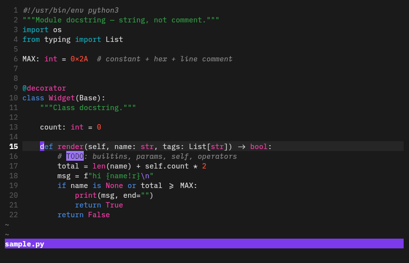

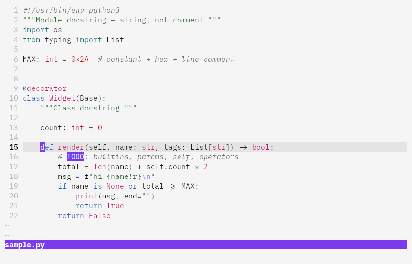

## Features

- **One file, both variants** — `set background=dark` or `light` before (or
  after) `colorscheme hestia`; the scheme follows `&background`.
- **Vim and Neovim, one colour language** — Neovim's treesitter captures
  (`@keyword`, `@function.call`, …) and LSP semantic tokens are linked to the
  same highlight groups Vim's regex syntax uses, so what each colour *means*
  can't drift between the editors; diagnostics and their underlines are mapped
  to the palette too. (The two still tokenise differently — treesitter parses
  where Vim pattern-matches — so token boundaries can differ in places, e.g.
  markdown structure or `TODO` markers. The screenshots below are plain Vim.)
- **Truecolor with an exact 256-colour fallback** — with `termguicolors` you
  get the exact palette; without it, hand-picked xterm-256 cells.
- **Accessibility as a design rule** — every plain-text syntax foreground
  clears WCAG AA (4.5:1) against the ground *and* the raised surfaces
  (cursorline, popup menus) of its variant.
- **A tasteful italic layer** — builtins, parameters, `self`/`this`/`cls` and
  booleans render in their group's colour but italic: extra structure without
  extra hues.
- **Diff *fills*, not recoloured text** — vimdiff rows get low-saturation
  tinted backgrounds while the code on them keeps its syntax highlighting
  (most schemes flood-recolour the whole line):

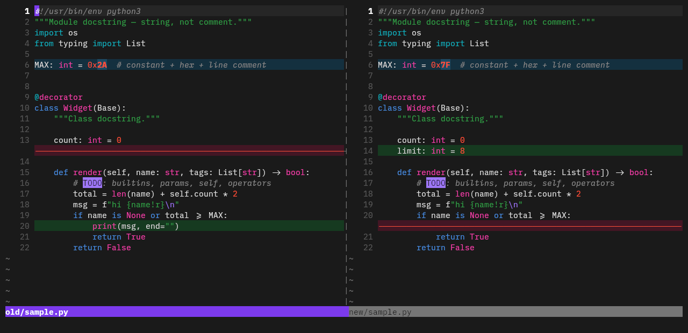

## Install

Requires Vim 8.2+ or any maintained Neovim. `termguicolors` is recommended
(exact colours); 256-colour terminals work via the built-in fallback.

**lazy.nvim**

```lua
{
  "dimitrios-git/hestia.vim",
  lazy = false,
  priority = 1000,
  config = function()
    vim.o.termguicolors = true
    vim.o.background = "dark" -- or "light"
    vim.cmd.colorscheme("hestia")
  end,
}
```

**vim-plug**

```vim
Plug 'dimitrios-git/hestia.vim'
```

```vim
set termguicolors
set background=dark   " or light
colorscheme hestia
```

**Vim native packages**

```sh
git clone https://github.com/dimitrios-git/hestia.vim \
    ~/.vim/pack/themes/start/hestia.vim
```

**Manual** — copy `colors/hestia.vim` into `~/.vim/colors/` (Vim) or
`~/.config/nvim/colors/` (Neovim).

## Palette

The ground is `#1a1a1a` (dark) / `#f5f5f5` (light), text `#e0e0e0` / `#1a1a1a`,
and the accent — cursor, statusline, selections — is the hestia violet
**`#7c3aed`** in both variants. The syntax hues:

| Role | Dark | Light |
|---|---|---|
| Keywords, operators | `#4a8fe4` | `#1c65bd` |
| Strings | `#32a148` | `#247534` |
| Functions | `#f840ac` | `#c60777` |
| Types | `#e0a020` | `#855f12` |
| Constants, numbers | `#ff4f38` | `#cc1800` |
| Preprocessor, imports, decorators | `#0cb2c0` | `#08717a` |
| Escapes, regex, special | `#9e77f7` | `#733af4` |
| Comments | `#8c8c8c` | `#6c6c6c` |
| Errors | `#d70000` | `#d70000` |

The green/magenta/coral/teal/purple family comes from
[thecodingidiot](https://thecodingidiot.com)'s Memphis brand accents; keyword
blue and type yellow are deliberate functional anchors (a warm/cool split code
needs to scan). Each hue is lightness-tuned per variant until it clears AA.

## More languages

<details>
<summary><b>TypeScript</b></summary>

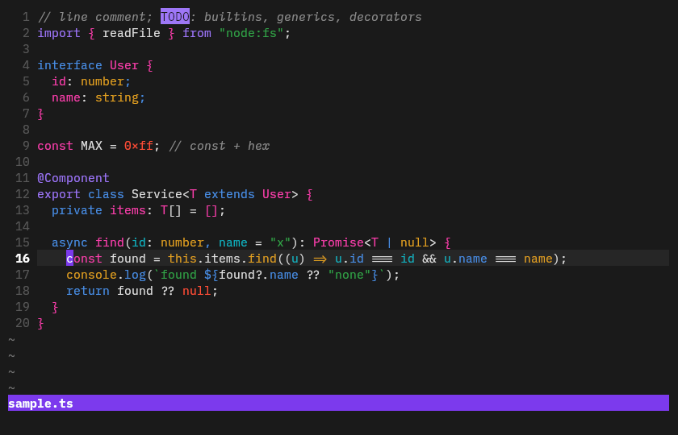
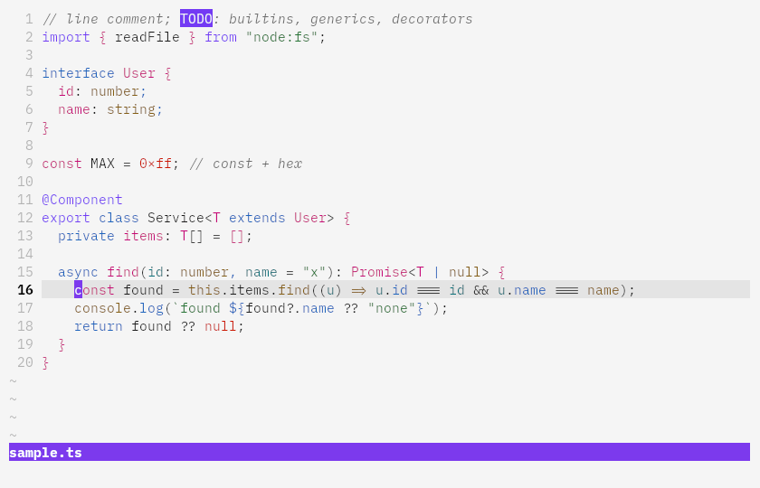
</details>

<details>
<summary><b>Rust</b></summary>

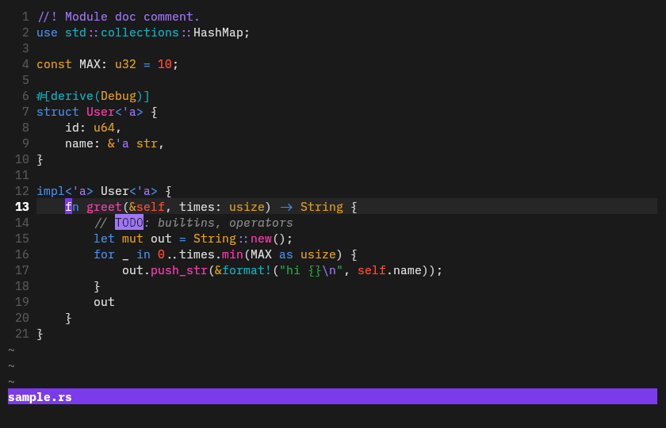
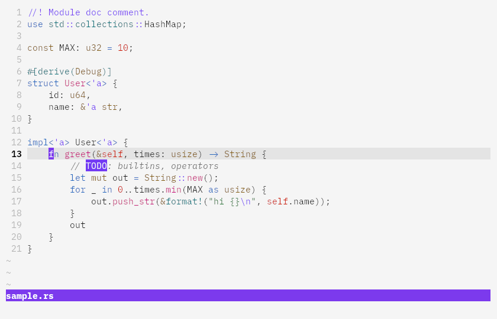
</details>

<details>
<summary><b>Go</b></summary>

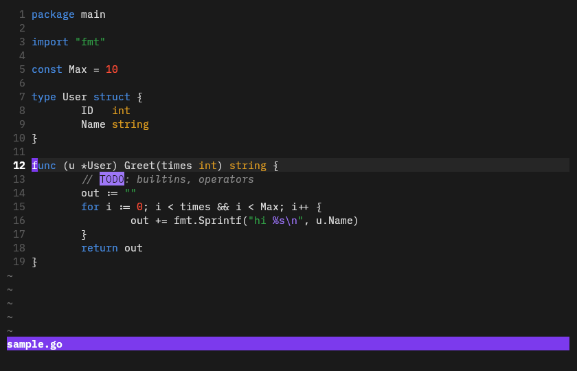
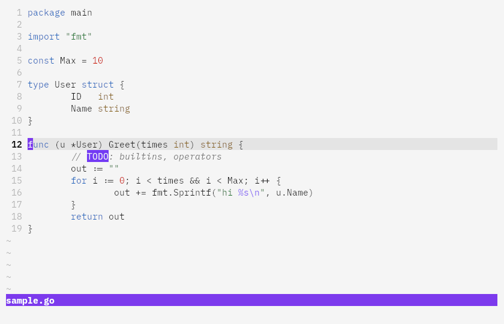
</details>

<details>
<summary><b>C</b></summary>

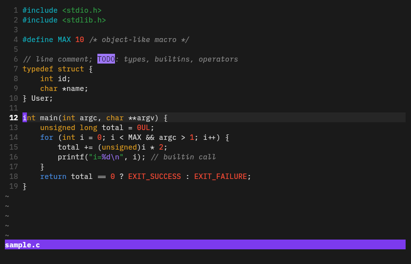
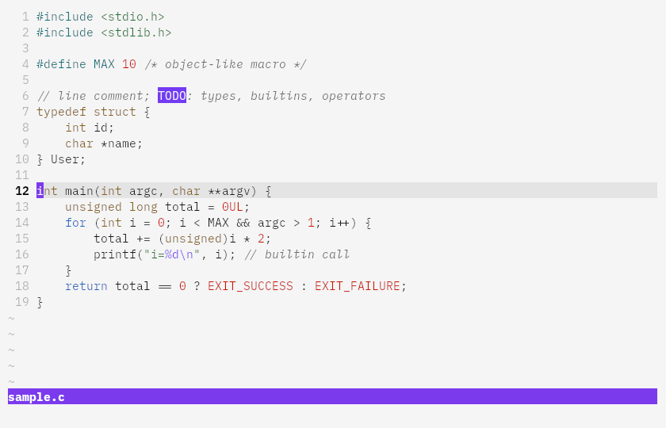
</details>

<details>
<summary><b>Lua</b></summary>

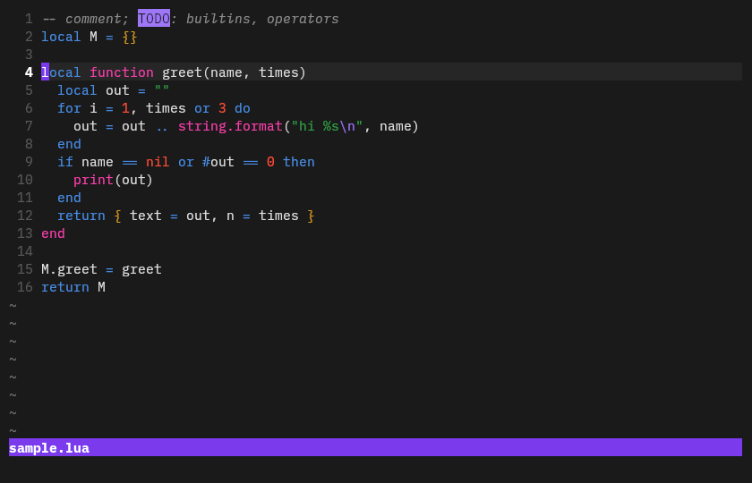
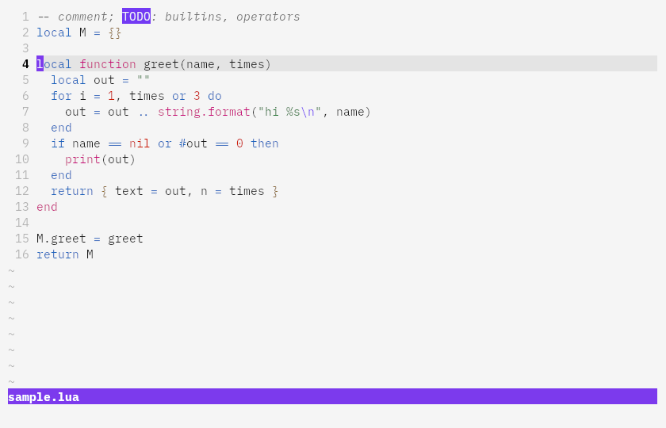
</details>

<details>
<summary><b>Shell</b></summary>

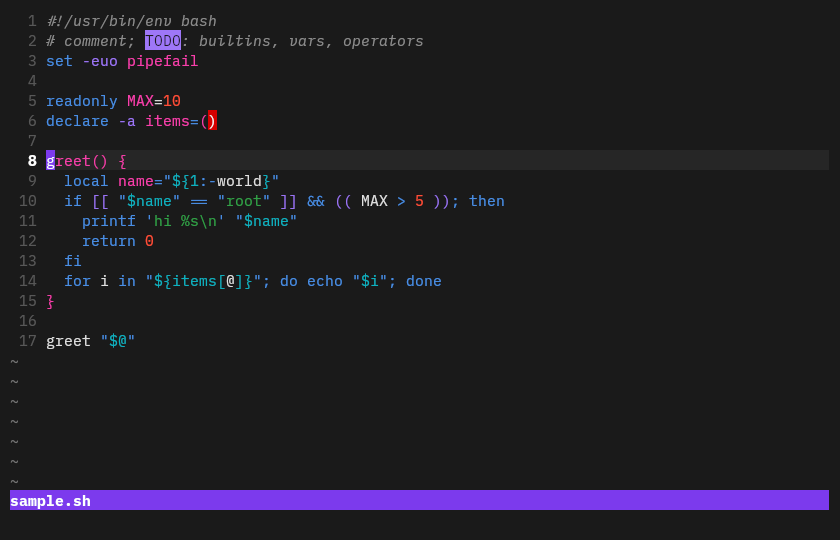
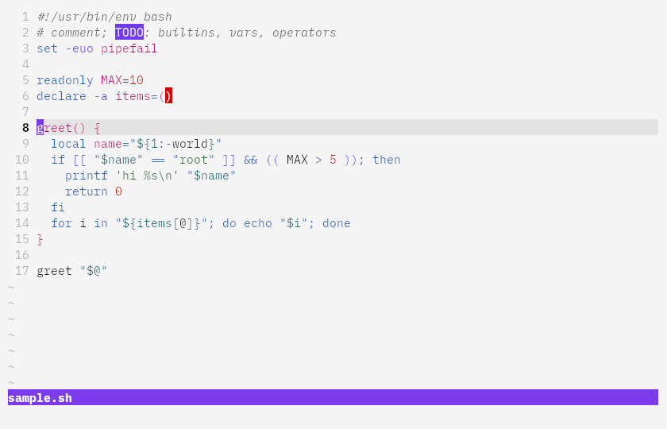
</details>

<details>
<summary><b>Markdown</b></summary>

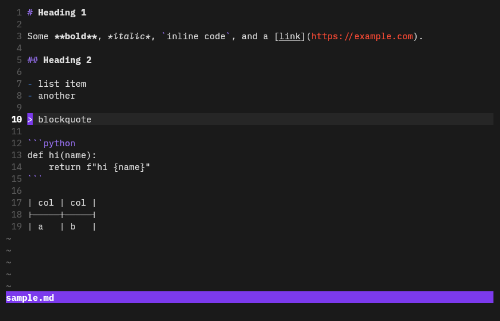
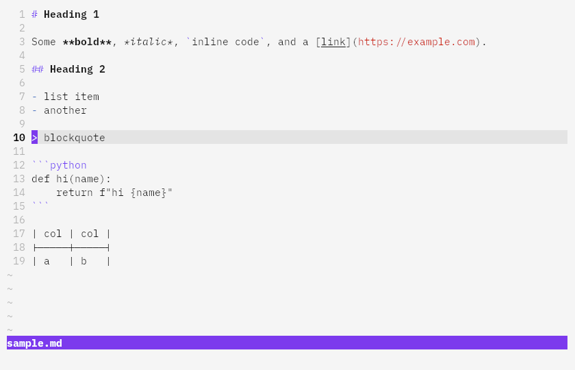
</details>

<details>
<summary><b>vimdiff, light</b></summary>

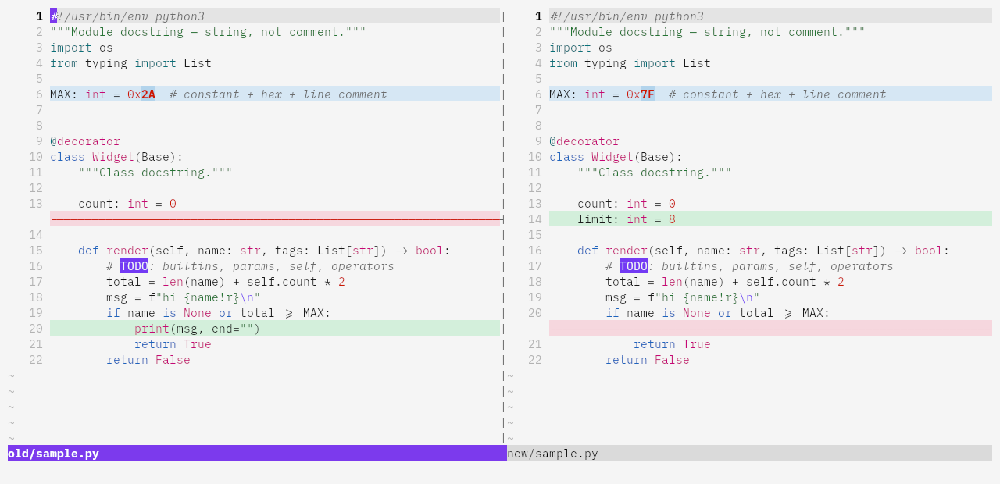
</details>

Screenshots are plain `vim` (no plugins) in [kitty](https://sw.kovidgoyal.net/kitty/)
with Lilex Nerd Font, shot headlessly by hestia's screenshot rig — just the
terminal surface, no desktop chrome around it. (Python is up top.)

## Contributing — this file is generated

`colors/hestia.vim` is a **generated artifact**: it is rendered by
[`themes/hestia/render.py`](https://github.com/dimitrios-git/hestia/tree/main/themes/hestia)
from hestia's palette (`palette.yml`, the single source of truth for the whole
desktop — terminal, bat, VS Code, web code blocks all render from the same
tables) and mirrored here verbatim. The version of this repo tracks the palette
version stamped in the file's first line.

- **Bug reports and suggestions**: issues are welcome here.
- **Colour changes**: land in hestia's `palette.yml`/`scopes.yml` and are
  re-rendered — a PR editing `colors/hestia.vim` directly can't be merged,
  since the next render would overwrite it.

## Attribution

- The palette's ancestor is **[wildcharm](https://github.com/vim/colorschemes)**
  by Maxim Kim — hestia's palette was originally derived from it, and this
  scheme preserves that lineage (with hestia's documented deviations: the
  violet accent, the Memphis-brand syntax re-anchor, AA-driven lifts).
- Syntax hues from **thecodingidiot**'s Memphis brand accents.
- Generated from the **[hestia](https://github.com/dimitrios-git/hestia)**
  palette, where the design decisions (and their reasoning) are logged.

## License

[GPL-3.0](LICENSE), same as hestia.
